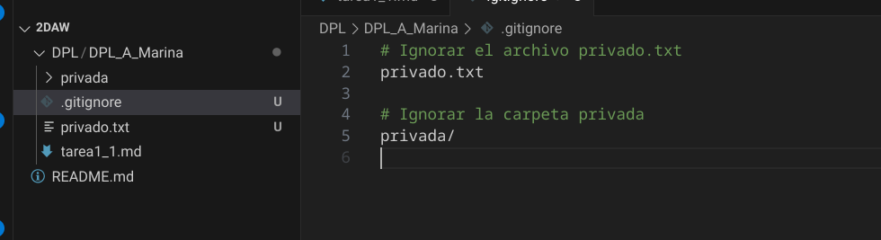
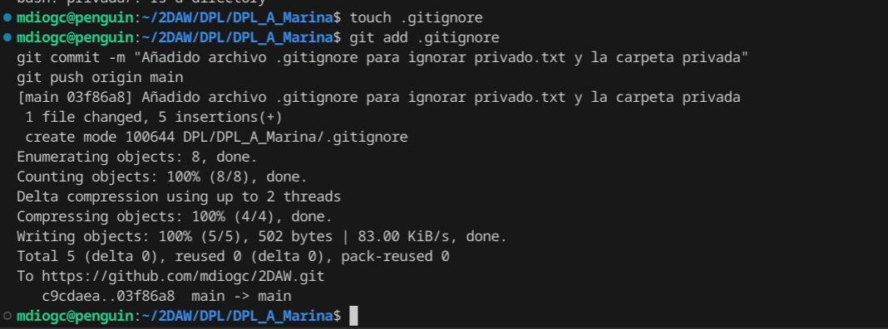
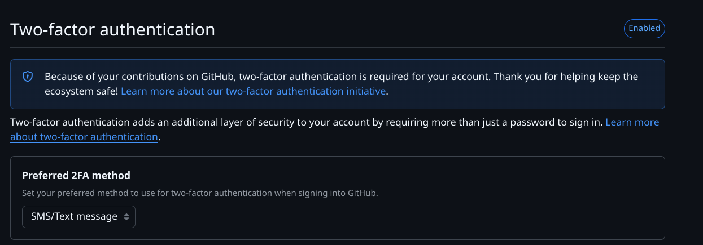
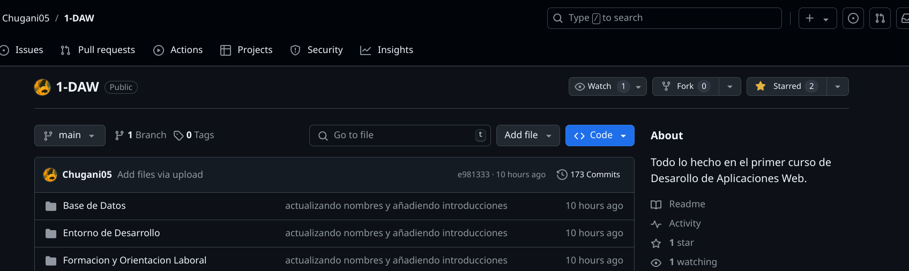

<div align="justify";>


# Tarea 1

## CREACIÓN DEL ARCHIVO README (1 PUNTO)
Crear (si no lo habéis hecho ya) en vuestro repositorio local un documento `tarea1_1.md`. En este documento tendrán que ir poniendo los comandos que han utilizado durante el ejercicio, las explicaciones y capturas de pantalla que consideren necesarias.


```bash
echo "# Tarea 1" > tarea1_1.md
```

## COMMIT INICIAL (1 PUNTO)
Añadir al `tarea1_1.md` los comandos utilizados hasta ahora y hacer un commit inicial con el mensaje `commit inicial`.

```bash
git add tarea1_1.md
git commit -m "commit inicial"
```

## PUSH INICIAL (1 PUNTO)
Subir los cambios al repositorio remoto.
```bash
git push origin main
```

## IGNORAR ARCHIVOS (1 PUNTO)
1. Crear en el repositorio local un fichero llamado `privado.txt`.
2. Crear en el repositorio local una carpeta llamada `privada`.

```bash
touch privado.txt
mkdir privada
```
3. Realizar los cambios oportunos para que tanto el archivo como la carpeta sean ignorados por git. (Incluir capturas de pantalla).





## AÑADIR FICHERO 1.txt (1 PUNTO)
Añadir `1.txt` al repositorio local.

```bash
touch 1.txt
```
```bash
git add 1.txt
git commit -m "Añadido fichero 1.txt"
```
## CREAR EL TAG v0.1 (1 PUNTO)
Crear un tag `v0.1`.

```bash
git tag v0.1
```

## SUBIR EL TAG v0.1 (1 PUNTO)
Subir los cambios al repositorio remoto.
```bash
git push origin v0.1
```
## CONFIGURACIÓN Y USO SOCIAL DE GITHUB (1 PUNTO)
1. Poner una foto en vuestro perfil de GitHub.


2. Poner el doble factor de autentificación en vuestra cuenta de GitHub.



3. Seguir los repositorios de vuestros compañeros.
4. Añadir una estrella a los repositorios del resto de tus compañeros.



## CREAR UNA TABLA (1 PUNTO)
Crear una tabla de este estilo en el fichero `tarea1_1.md` con la información de varios de tus compañeros de clase:

| Nombre del compañero | Repositorio |
|----------------------|-------------|
| Rashi           | [Link](https://github.com/Chugani05) |
| Kai         | [Link](https://github.com/YoooKai) |
| Rafael|[Link](https://github.com/RafaelMayor)|
</div>