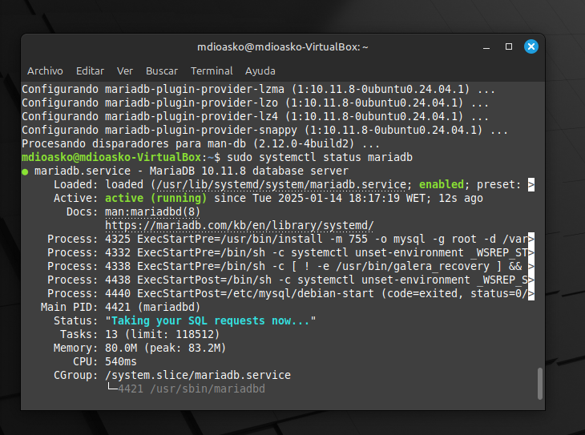
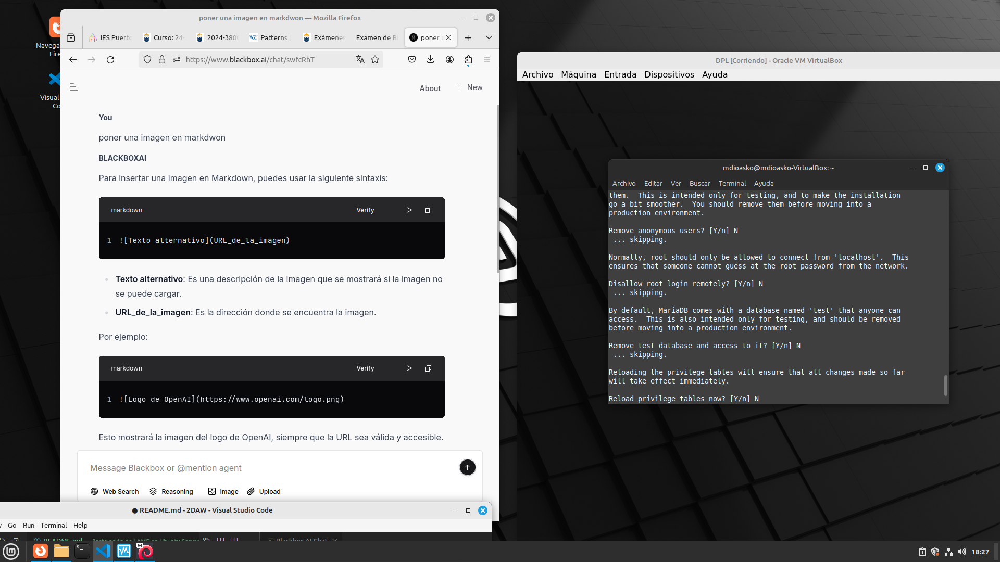
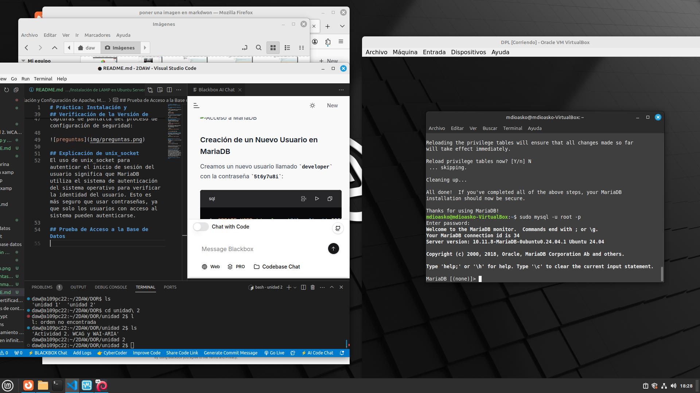
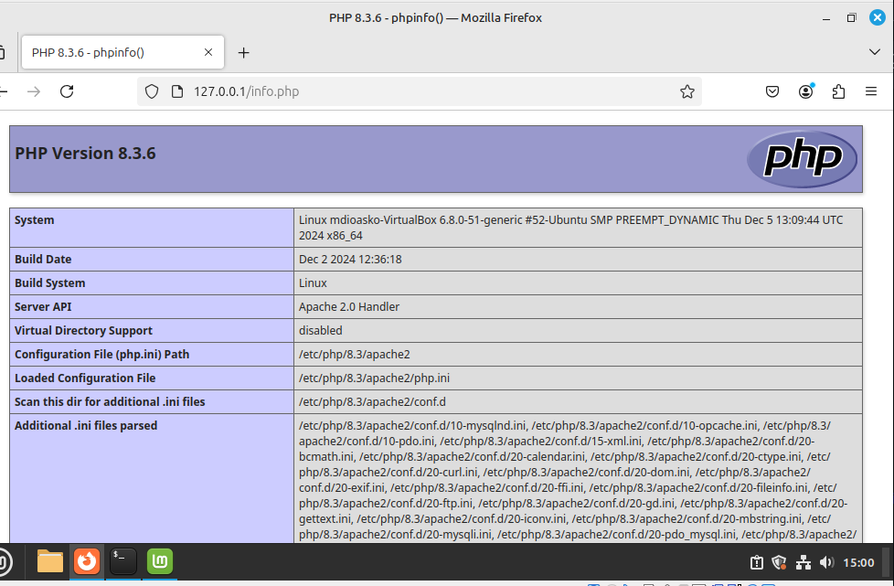
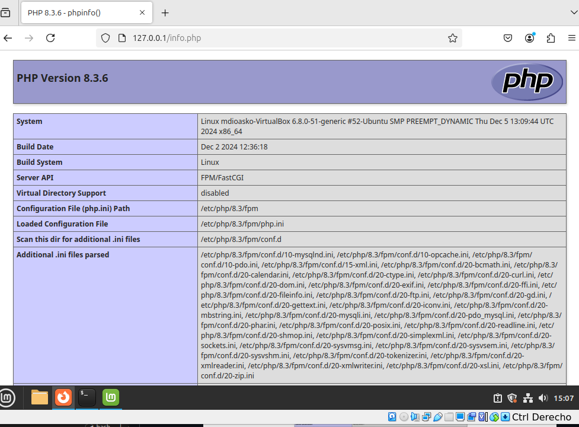

# Práctica: Instalación y Configuración de Apache, MariaDB y PHP

## 1. Actualización del Repositorio y Paquetes

Primero, actualizamos el repositorio y los paquetes del sistema:

```bash
sudo apt update
sudo apt upgrade
```
## 2. Instalación del Servidor Apache
Instalamos el servidor web Apache:

```bash
sudo apt install apache2
```
## 3. Instalación del Servidor de Base de Datos MariaDB
Instalamos MariaDB, que es un reemplazo directo para MySQL:

```bash
sudo apt install mariadb-server mariadb-client
```
Verificación del Estado de MariaDB
Para comprobar el estado del servidor MariaDB:

```bash
sudo systemctl status mariadb
```



## Habilitar MariaDB en el Arranque
Para permitir que MariaDB se inicie automáticamente en el arranque:

```bash
sudo systemctl enable mariadb
```

## Verificación de la Versión de MariaDB
Para verificar la versión de MariaDB instalada:
```bash
mariadb --version
```


Capturas de pantalla del proceso de configuración de seguridad:



## Explicación de unix_socket
El uso de unix_socket para autenticar el inicio de sesión del usuario significa que MariaDB utiliza el sistema de autenticación del sistema operativo para verificar la identidad del usuario. Esto es más seguro que usar contraseñas, ya que solo los usuarios con acceso al sistema pueden autenticarse.

## Prueba de Acceso a la Base de Datos

Para probar el acceso a la base de datos, podemos utilizar el comando `mysql`:



## Creación de un Nuevo Usuario en MariaDB
Creamos un nuevo usuario llamado developer con la contraseña 5t6y7u8i:

```sql
CREATE USER 'developer'@'localhost' IDENTIFIED BY '5t6y7u8i';
GRANT ALL PRIVILEGES ON *.* TO 'developer'@'localhost';
FLUSH PRIVILEGES;
```
Capturas de pantalla del proceso de creación del usuario:
 

## Prueba del acceso a la base de datos con el nuevo usuario

```bash
mysql -u developer -p
```

## Instalación de la última versión de PHP
 ```bash
sudo apt install php
 ```


## Activación del módulo Apache PHP

```bash
sudo a2enmod php
sudo systemctl restart apache2
```


## Una vez guardado el archivo, podemos acceder a él a través del navegador escribiendo la dirección: http://dirección-ip/info.php



# Ejecutando código PHP en Apache


## Para cambiar a PHP-FPM, primero deshabilitamos el módulo PHP de Apache:

```bash
sudo a2dismod php8.3
```

## Instalamos PHP-FPM con el siguiente comando:

```bash
sudo apt install php8.3-fpm
```

## A continuación, habilitamos los módulos proxy_fcgi y setenvif:

```bash
sudo a2enmod proxy_fcgi setenvif
```


## Habilitamos el archivo de configuración de PHP-FPM:
```bash
sudo a2enconf php8.3-fpm
```

## Finalmente, reiniciamos el servidor Apache para aplicar los cambios:

```bash
sudo systemctl restart apache2
```

