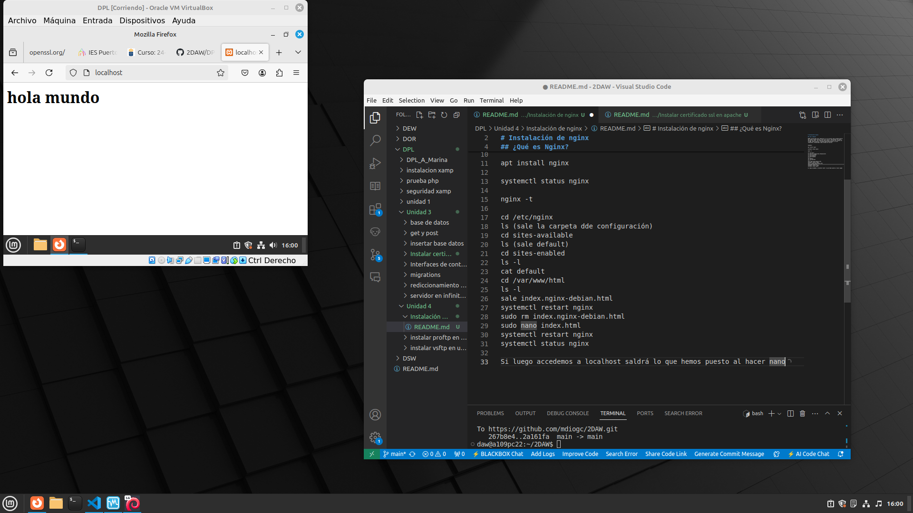

# Guía de Instalación y Configuración de Nginx

Este documento proporciona una guía paso a paso para instalar y configurar Nginx en un sistema basado en Debian/Ubuntu.

## Requisitos Previos

Asegúrate de tener acceso a un terminal con privilegios de superusuario (root) o la capacidad de usar `sudo`.

## Pasos de Instalación y Configuración

1. **Instalar Nginx**

   Ejecuta el siguiente comando para instalar Nginx:

   ```bash
   sudo apt install nginx
   ```
2. **Verificar el estado de Nginx**

Comprueba que Nginx se esté ejecutando correctamente:

```bash
systemctl status nginx
```
o usando 
```bash
nginx -t
```
3. **Navegar a la carpeta de configuración**

Cambia al directorio de configuración de Nginx:
```bash
cd /etc/nginx
```
Lista los archivos de configuración:

```bash
ls
```
4. Revisar sitios disponibles y habilitados

Navega a la carpeta de sitios disponibles:
```bash
cd sites-available
```

Lista los archivos (deberías ver default):
```bash
ls 
```

Navega a la carpeta de sitios habilitados:
```bash
cd sites-enabled
```
Lista los archivos habilitados:
```bash
ls -l
```
5. Revisar la configuración del sitio por defecto

Visualiza el archivo de configuración por defecto:
```bash
cat default
```
6. Navegar al directorio web

Cambia al directorio donde se encuentran los archivos HTML:
```bash
cd /var/www/html
```

Lista los archivos en este directorio (deberías ver index.nginx-debian.html)
```bash
ls -l
```
7. Reiniciar Nginx

Reinicia Nginx para aplicar cambios:
```bash
systemctl restart nginx
```
8. Eliminar el archivo HTML por defecto

Elimina el archivo por defecto:
```bash
sudo rm index.nginx-debian.html
```
9. Crear un nuevo archivo HTML

```bash
sudo nano index.html
```
10. Reiniciar Nginx nuevamente y ver su estado

Reinicia Nginx para aplicar los cambios:
```bash
systemctl restart nginx
systemctl status nginx
```
11. Acceder a tu sitio

Abre un navegador y accede a localhost para ver el contenido que has puesto en index.html.
Siguiendo estos pasos, deberías poder instalar y configurar Nginx en tu sistema.

EN este caso veremos ```hola mundo```

